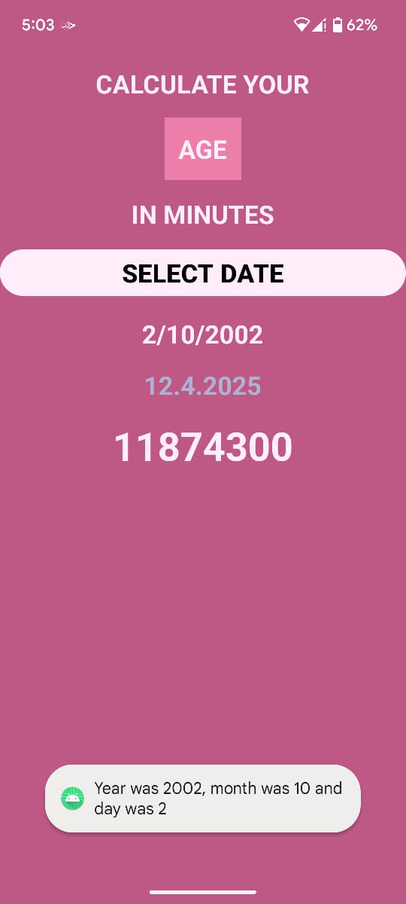

# 🕒 Age in Minutes Calculator

This is a simple Android application built with **Kotlin** and **XML layout** that calculates your age in minutes from your date of birth. It's a fun way to understand how many minutes you've lived!

---

## ✨ Features

- Pick your date of birth using a date picker.
- Instantly see your age in **minutes**.
- Clean and intuitive user interface.

---

## 📸 Screenshots



> You can replace the placeholder with your actual screenshot in `screenshots/age_in_minutes.png`.

---

## 🛠️ Built With

- Kotlin
- Android SDK
- XML Layout
- DatePickerDialog

---

## 🚀 Getting Started

1. Clone the repository:
    ```bash
    git clone https://github.com/mashhukhangandapure/AgeInMinutesCalculator.git
    ```
2. Open in Android Studio.
3. Run the app on an emulator or Android device.

---


